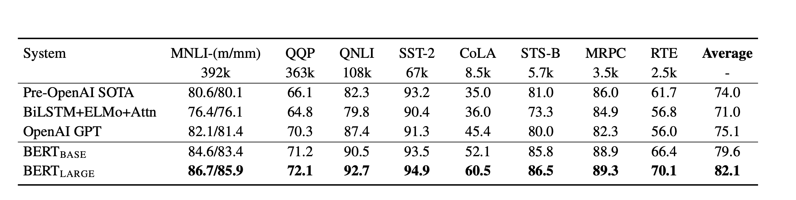

# RAGとは？
RAGとは、一言で言うと「従来の検索の仕組みにLLMを組み込むことで、LLMが生成する検索結果をより事実に基づいたものにする仕組み」である（僕はサイエンス畑ではないので多分そうだと理解してる）。

# RAGが登場するまでの検索の仕組み
2018年、Googleは下記論文にて、

“BERT: Pre-training of deep bidirectional transformers for language understanding” (2018)
https://arxiv.org/abs/1810.04805

BEAT（Bidirectional Encoder Representations from Transformers）が検索の歴史で最大の進歩であると主張した。

“Understanding searches better than ever before” (2019)
https://blog.google/products/search/search-language-understanding-bert/

自然言語処理の分野のベンチマークでOpenAIの初代GPTを上回る性能であることがわかる。

それに負けじと、MicrosoftのBingは2019年の4月から巨大なtransformerを利用して検索性能の最大級の進歩を遂げたと主張した。

“Bing delivers its largest improvement in search experience using Azure GPUs” (2019)
https://azure.microsoft.com/en-us/blog/bing-delivers-its-largest-improvement-in-search-experience-using-azure-gpus/

BERTを用いた検索のミソはこれらがただのキーワード検索ではなく、言葉の意味を考慮して検索することである（Semantic Search）。

# RAGが登場するまでのLLMを用いた検索

LLMへ質問すると、事実に基づいた答えが返ってくることを人々は期待している。しかし、LLMが登場した当初は、流暢で自信に満ち溢れた回答であったとしても、回答は必ずしも正確でなかったり、元となるデータが古いといったことが起きていた。

モデルが学習しているデータの最新の日時はcutoffといい、GPT-4.1の現在のcutoffは2024/1である。
https://platform.openai.com/docs/models/compare?model=o3

LLMの出力が事実ではない事象はハルシ
ネーションといい、それを避けるための仕組みとしてRAGが考案された。

RAGでは、事実に基づいた情報を検索によって取得し、LLMへ提供することで、LLMがより事実に基づいた出力ができるよう補助している。